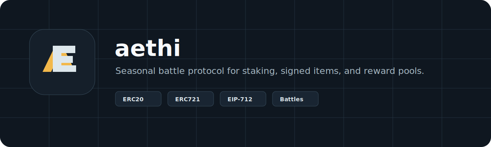

<p align="center">
  
</p>

<p align="center">
  <a href="#"></a>
  <a href="#"></a>
  <a href="#"></a>
  <a href="#"></a>
</p>

# aethi

Aethi is a season-based GameFi protocol where players stake AETHI, mint signed item NFTs, enter competitive seasons, build score, and claim token rewards.

The protocol combines ERC20 token economics, ERC721 game items, staking-based access, season reward pools, and EIP-712 signed item minting into a modular smart contract system.

## Game overview

Aethi is built around competitive seasons.

Players stake AETHI to unlock access to active seasons. Item NFTs represent game passes, score modifiers, badges, or campaign rewards. These items are not unrestricted public mints: each mint requires an EIP-712 authorization signed by an approved item signer.

During a season, players can equip one item. Equipped items apply a score boost when the game operator records player progress. After the season ends, rewards are distributed pro-rata from the season pool based on final score.

<p align="center">
  
</p>

## Protocol modules

| Module | Contract | Description |
| --- | --- | --- |
| Token | `AethiToken` | Capped ERC20 token with permit, pausing, and role-gated minting. |
| Items | `AethiItems` | ERC721 item collection with EIP-712 signed minting, nonces, deadlines, metadata, and pause control. |
| Staking | `AethiStaking` | AETHI staking vault with time-based rewards and bounded reward accounting. |
| Game | `AethiGame` | Season manager for joining, equipping items, recording boosted score, finalizing seasons, and claiming rewards. |
| Rewards | `AethiRewardDistributor` | Controlled reward vault for bonus campaigns and operational payouts. |

## Gameplay loop

```text
Acquire AETHI
    ↓
Stake AETHI
    ↓
Mint signed item NFT
    ↓
Join an active season
    ↓
Equip item and earn boosted score
    ↓
Claim pro-rata season rewards
```

## Security design

Aethi uses OpenZeppelin Contracts for core token standards and security primitives.

- ERC20 and ERC721 implementations from OpenZeppelin.
- EIP-712 item mint authorizations.
- Per-player nonces to prevent signature replay.
- Deadlines to limit signature lifetime.
- Capped item power to limit boost abuse.
- Role-based access control for admin, signer, operator, reward, and pause permissions.
- Reward-per-share staking accounting with no loops over all stakers.
- Reentrancy guards around token-moving flows.
- Emergency pause controls across token, items, staking, gameplay, and rewards.

The current game result model uses trusted operator-recorded scores. This avoids insecure on-chain pseudo-randomness and leaves a clean path toward signed score attestations, oracle-backed results, or verifiable game-server proofs.

## Repository structure

```text
src/
  game/        Season gameplay coordinator
  interfaces/  Minimal cross-contract interfaces
  items/       ERC721 item NFTs
  rewards/     Reward distribution vault
  staking/     AETHI staking vault
  token/       AETHI ERC20 token

test/
  game/
  items/
  rewards/
  staking/
  token/

script/
  DeployAethi.s.sol

docs/
  architecture.md
  threat-model.md
```

## Development

Install Foundry, then run:

```shell
forge fmt
forge build
forge test -vvv
```

## Deployment

Configure environment variables from `.env.example`, then deploy:

```shell
forge script script/DeployAethi.s.sol:DeployAethi \
  --rpc-url "$RPC_URL" \
  --broadcast \
  --verify
```

The deployment script creates and wires:

1. `AethiToken`
2. `AethiItems`
3. `AethiStaking`
4. `AethiGame`
5. `AethiRewardDistributor`

## Documentation

- [Architecture](docs/architecture.md)
- [Threat Model](docs/threat-model.md)

## Brand assets

- [Logo mark](docs/assets/aethi-logo-mark.svg)
- [Logo mark PNG 512](docs/assets/aethi-logo-mark-512.png)
- [Logo mark PNG 256](docs/assets/aethi-logo-mark-256.png)
- [Logo mark PNG 128](docs/assets/aethi-logo-mark-128.png)
- [Wordmark](docs/assets/aethi-wordmark.svg)
- [Repository banner](docs/assets/aethi-banner.svg)
- [Social preview](docs/assets/aethi-social-preview.svg)

## Status

Aethi is under active development. The current contracts are suitable for local and testnet experimentation. Production deployment should follow a full security process, including invariant testing, static analysis, multisig role assignment, monitoring, and independent audit.
